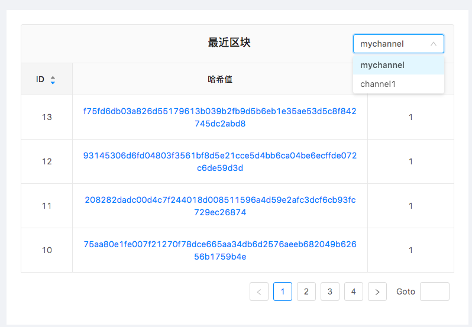
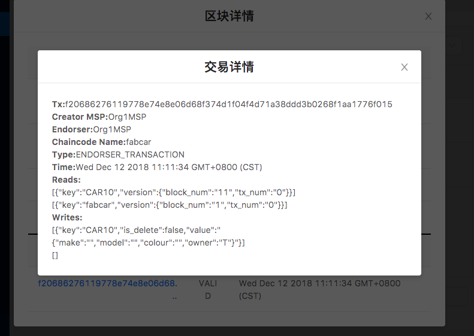
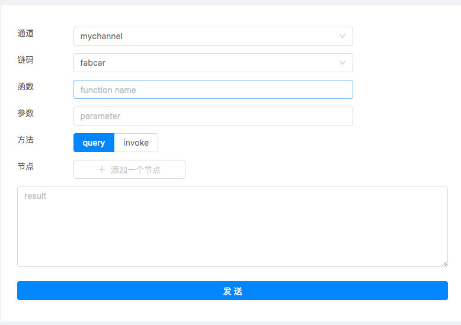
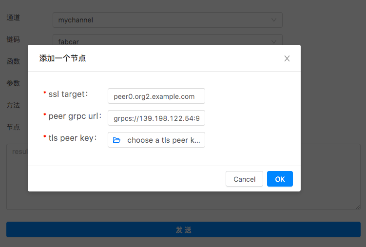
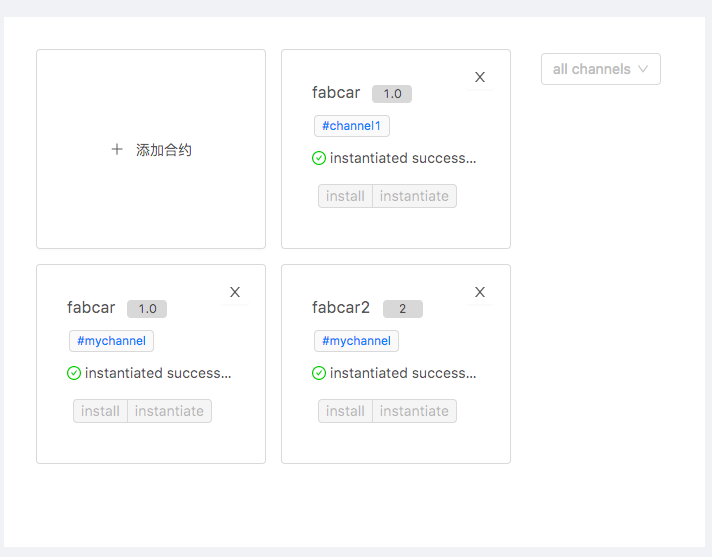
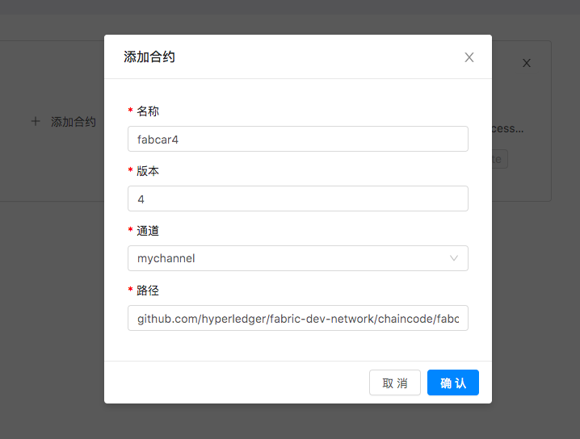
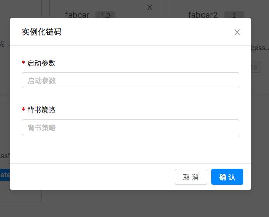
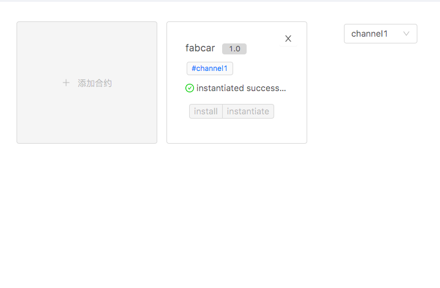
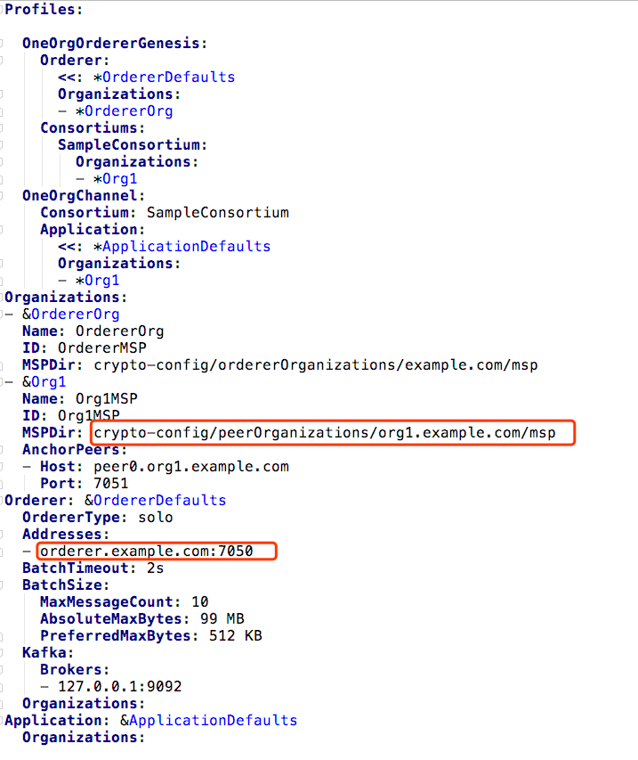

# 用户文档

## 预览

1. 开始使用客户端
2. 联系我们

### 1.开始使用客户端

#### 1.1 安装客户端

如果您不清楚如何安装源代码和客户端，您可参考[setup](setup-Ch.md)文档。

#### 1.2 开始使用

双击打开客户端，现在开始使用客户端，现在客户端包含五个部分：

1. 用户登录
2. 数据看板
3. 链码调用
4. 链码安装
5. 通道管理

##### 1.2.1 用户登录
输入登录页各项，点击登录。（见下图）

> 注意：  
> 在hyperledger fabric体系的角色里，存在peer\orderer\user三种角色，客户端面向user角色。
> 在user角色下，存在admin和普通user两种身份，admin可安装和实例化(install和instantiate)链码，
> 而普通user只可调用和查询(invoke和query)链码。

操作演示：

一、如我们要连接到未开启TLS加密通讯的本地fabric网络，以`admin`身份登录:
- peer grpc url 填 `grpc://localhost:7051` 
- peer event url 填 `grpc://localhost:7053`
- orderer url 填 `grpc://localhost:7050`
- msp id 填 `Org1MSP`
- 选择certificate文件为`crypto-config/peerOrganizations/org1.example.com/users/Admin@org1.example.com/signcerts`文件夹下的证书文件`*.pem`
- 选择private key文件为`crypto-config/peerOrganizations/org1.example.com/users/Admin@org1.example.com/keystore`文件夹下的私钥文件文件`*_sk`
- 余下TLS相关的非必填项留白
- 点击登录

> 注：未开启TLS加密，节点地址填`grpc://`, 开启TLS加密则填入`grpcs://`

二、若节点通讯启用了TLS加密，则
- peer grpc url 填 `grpcs://localhost:7051` 
- peer event url 填 `grpcs://localhost:7053`
- orderer url 填 `grpcs://localhost:7050`
- msp id 填 `Org1MSP`
- certificate 选择文件为`crypto-config/peerOrganizations/org1.example.com/users/Admin@org1.example.com/signcerts`文件夹下的证书文件`*.pem`
- private key 选择文件为`crypto-config/peerOrganizations/org1.example.com/users/Admin@org1.example.com/keystore`文件夹下的私钥文件文件`*_sk`
- peer tls ca cert 选择文件为`crypto-config/peerOrganizations/org1.example.com/users/Admin@org1.example.com/tls/ca.crt`，或`crypto-config/peerOrganizations/org1.example.com/tlsca/tlsca.org1.example.com-cert.pem`。文件内容一致。
- orderer tls ca cert 选择文件为`crypto-config/ordererOrganizations/example.com/users/Admin@example.com/tls/ca.crt`，或`crypto-config/ordererOrganizations/example.com/tlsca/tlsca.example.com-cert.pem`。文件内容一致。
- peer ssl target 填入peer节点的Domain域名，可根据crypto-config.yaml文件中的定义
- orderer ssl target 填入orderer节点的Domain域名，可根据crypto-config.yaml文件中的定义  

> 注：ssl target 在生产环境下，证书域名应与实际节点地址一致。而在非生产环境中，
> 由于证书校验的地址与节点所在地址不一致，使得需人工声明域名。

##### 1.2.2 数据看板
在数据看板中，我们可以查询与通道相关的区块信息。例如选择`mychanel`，则可看到该通道内区块信息。   

点击表格中`哈希值`列任一行的记录，可查看`区块详情`信息，并可查看`交易列表`及交易是否有效，如下：

点击`交易列表`的任一记录，可查看交易具体信息:

##### 1.2.3 链码调用
在链码调用界面中，选择`通道`、`链码`后，输入`函数名称`、`参数`(其中参数可输入多个，通过输入回车来间隔)，
如选择`query`，点击`发送`按钮，则可以查询相关信息。

如选择`invoke`，点击`发送`按钮,则可进行相关链码调用、账本更新。

如在`invoke`操作时需要多节点背书，添加更多节点进行背书。（注：当前默认会调用用户登录页输入的peer节点，只需添加额外的节点即可）

具体操作可参考[Quqering the Ledgr](https://hyperledger-fabric.readthedocs.io/en/release-1.3/write_first_app.html#querying-the-ledger)。

> 注: 查询操作（query）只是查询数据，不会生成新的区块，调用操作（invoke）会发起新的交易，产生新的区块
> 此时，我们可以回到数据看板页面，可以看到已经产生了新的记录。

操作演示:

查询操作(query)：
- 输入通道为`mychannel`，
- 输入链码为`fabcar`，
- 输入函数为`queryAllCars`
- 参数为空，不需要任何输入
- 方法选择`query`

点击发送按钮，可以查看相关返回信息。

调用操作(invoke)：
- 输入通道为`mychannel`，
- 输入链码为`fabcar`，
- 输入函数为`changeCarOwner`
- 输入第一个参数`CAR10`，回车后输入第二个参数`Chuancey`，

点击发送按钮，我们可以查看相关返回信息提示成功后，回到数据看板页面，可查看新产生的区块。

这里链码不需要多节点背书，如果链码需要多节点背书，可添加相关节点进行背书。

##### 1.2.4 链码安装

在使用链码安装时，如果您将要操作的链码文件是Go语言类型，你的电脑需要安装Go语言，并配置好环境变量GOPATH。
链码文件需放置在`$GOPATH/src/...`目录下。

> 注：
> * 在Windows平台下，正常安装Go语言，设置系统环境变量即可。
> * 在MAC平台下，当你直接从程序的快捷方式打开客户端程序时，需设置针对GUI程序的环境变量，具体设置方法见[Desktop-FAQ](Desktop-FAQ-Ch.md)。
> * 在Linux平台下，你可以在`~/.profile`文件中进行配置，可参见[issue](https://github.com/blockchain-desktop/hyperledger-fabric-desktop/issues/140)  

点击`添加合约`按钮，将会弹出`添加合约`弹窗,可添加新的智能合约。

操作演示:
- 输入链码名称为`fabcar4`
- 输入链码版本为`4`
- 选择通道为`mychannel`
- 选择路径为`chaincode/fabcar/go`

点击确认。

> 注：
> fabric默认在GOPATH路径下src文件夹下寻找链码文件，路径只需具体到链码文件的所在文件夹，您可参考下面的例子：
如：要安装的链码文件的完整路径为：`/Users/my/go/src/chaincode/fabcar/go/fabcar.go`
GOPATH为`/Users/chuancey/go`，需填入的路径为：`chaincode/fabcar/go/fabcar.go`

如果觉得这样填入链码文件路径比较麻烦，我们已经提出了[issue](https://github.com/blockchain-desktop/hyperledger-fabric-desktop/issues/16)
，规划解决。

智能合约子窗口添加后，我们可以进行安装链码`install`和实例化链码`instantiate`。
如不需要额外参数，可直接点击`instantiate`，实例化链码。
如果需要设置链码的`启动参数`和`背书策略`,你可点击`instantiate with options`

输入相应参数，点击确认后，即可实例化链码，

> 注：
> * 启动参数，json格式的字符串数组。
> * 背书策略，json格式的背书策略，为fabric-node-sdk的原生格式，可参考[链接](https://fabric-sdk-node.github.io/global.html#ChaincodeInstantiateUpgradeRequest)

此外，我们还可以查看不同通道下已经实例化的链码有哪些，如查看`channel1`通道下：
                           

##### 1.2.5 通道管理

操作演示:

假设我们要生成只包含一个组织的通道，我们的`configtx.yaml`配置如下：

- `configtx.yaml`：选择configtx.yaml文件
- `msp folder`：选择证书文件夹路径。(注：该文件夹应包含configtx.yaml文件中定义的MSPDir证书目录和相应证书。建议configtx.yaml的MSPDir使用相对路径写法，如下图，则选择crypto-config文件夹目录即可。)
- `config name`：输入configtx.yaml中定义的profile名称。(注：如下图，则输入`OneOrgChannel`，即二进制工具`configtxgen -profile OneOrgChannel -outputCreateChannelTx ./config/channel.tx`命令的`-profile`选项的参数)
- `创建新通道` ：输入你所希望定义的通道名称，如`mychannel`。 点击创建，即可创建新通道
- `加入通道`：输入上述你所创建的通道名称，如`mychannel`，或由其他人创建的通道名称。点击加入，即可将当前连接的peer加入该通道。

### 2. 联系我们

如果您在使用上有任何问题，欢迎提出[issue](https://github.com/blockchain-desktop/hyperledger-fabric-desktop/issues)，
我们会及时处理，并对您的反馈报以真挚的感谢！
